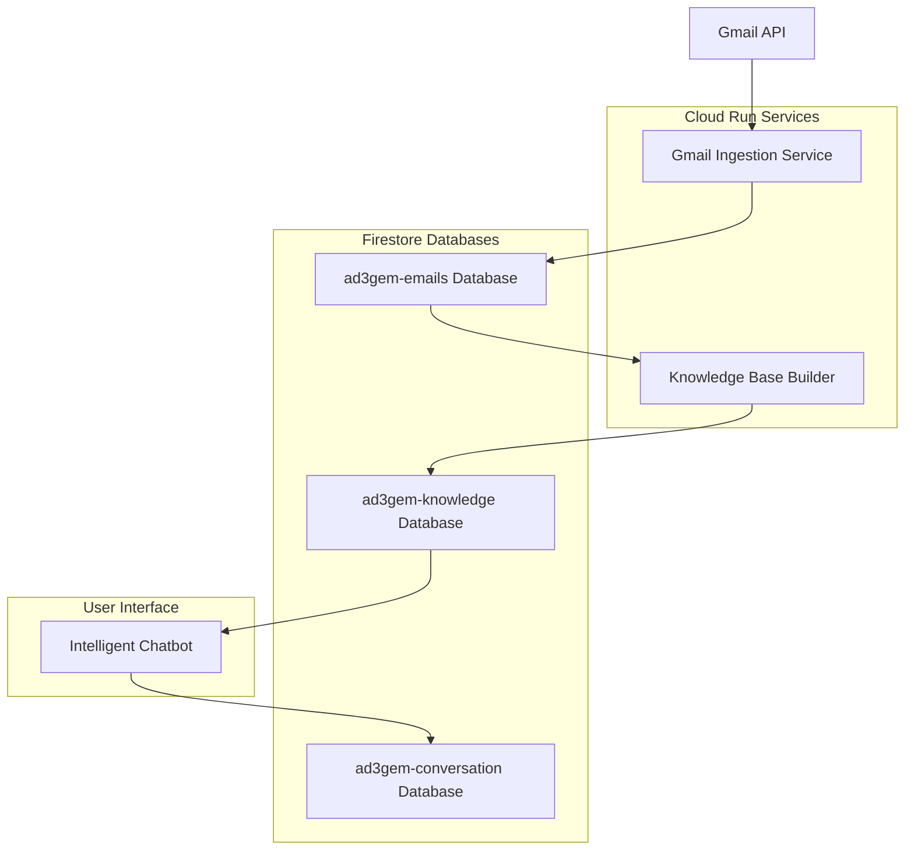
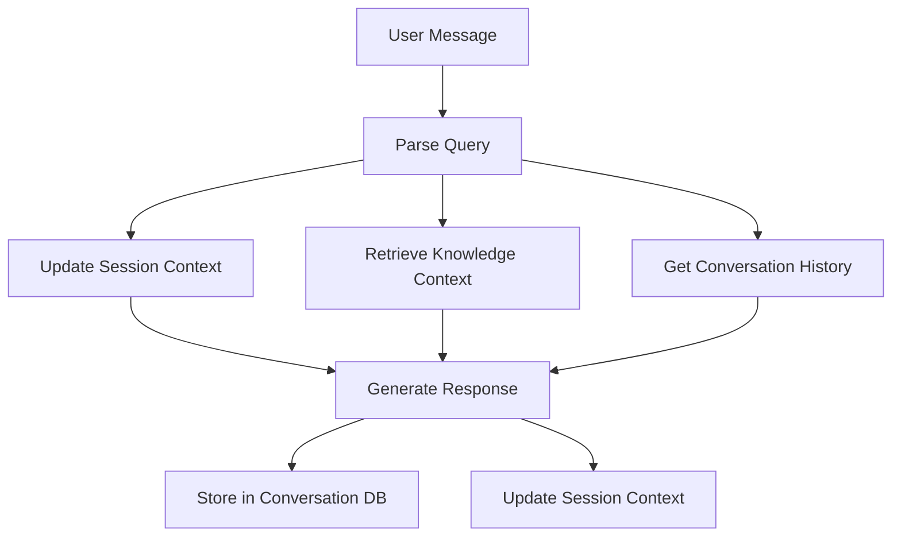

# AD3Gem Email Intelligence System - Product Requirements Document

**Version:** 2.0
**Date:** December 2024
**Status:** Implementation Ready

## Executive Summary

The AD3Gem Email Intelligence System is a comprehensive solution that ingests Gmail data from Google Workspace domains, extracts business intelligence, and provides an intelligent chatbot interface for natural language email queries. The system transforms raw email data into actionable insights through machine learning and semantic analysis.

## System Architecture Overview



## Database Architecture

### 1. `ad3gem-emails` - Email Storage Database

**Purpose:** Stores raw and processed email data from Gmail ingestion

#### Collections:

##### `incoming_raw/{ownerEmail}__{gmailMessageId}`
Lean metadata records for every email received.
```json
{
  "owner": "craig@lineagecoffee.com",
  "ownerDomain": "lineagecoffee.com",
  "gmailMessageId": "18ab2a0e5fcee098",
  "gmailThreadId": "18ab2a0e5fcee098",
  "rfc822MessageId": "<CAB1234@mail.gmail.com>",
  "references": ["<ref1@domain.com>"],
  "inReplyTo": "<parent@domain.com>",
  "internalDateMs": 1703097600000,
  "dateIso": "2024-12-07T10:30:00Z",
  "from": {"name": "Julie Thompson", "email": "julie@lineagecoffee.com"},
  "to": [{"name": "Craig", "email": "craig@lineagecoffee.com"}],
  "cc": [],
  "bcc": [],
  "replyTo": [],
  "subject": "Coffee Order Update",
  "subjectNormalized": "Coffee Order Update",
  "labelIds": ["INBOX", "IMPORTANT"],
  "labelNames": ["INBOX", "IMPORTANT"],
  "snippet": "Quick update on the coffee order...",
  "contentPreview": "Hi Craig, Quick update on the coffee order for next week...",
  "hasAttachments": false,
  "historyId": "1234567",
  "participants": ["craig@lineagecoffee.com", "julie@lineagecoffee.com"],
  "hasFullBody": false,
  "convKey": "sha1hash_of_conversation_key"
}
```

##### `threads/{gmailThreadId}`
Conversation thread metadata optimized for people searches.
```json
{
  "convKey": "sha1hash_of_conversation_key",
  "participants": ["craig@lineagecoffee.com", "julie@lineagecoffee.com"],
  "participantEmails": ["craig@lineagecoffee.com", "julie@lineagecoffee.com"],
  "fromEmails": ["julie@lineagecoffee.com"],
  "toEmails": ["craig@lineagecoffee.com"],
  "ownerUsers": ["craig@lineagecoffee.com"],
  "ownerGroups": [],
  "tags": [],
  "lastMessageAt": "2024-12-07T10:30:00Z",
  "latestSnippet": "Quick update on the coffee order...",
  "latestMessage": {
    "from": "julie@lineagecoffee.com",
    "fromName": "Julie Thompson",
    "preview": "Hi Craig, Quick update on the coffee order for next week. The beans will arrive on Tuesday instead of Monday...",
    "sentAt": "2024-12-07T10:30:00Z",
    "subject": "Coffee Order Update"
  },
  "subject": "Coffee Order Update",
  "hasExternal": false,
  "isInternalOnly": true,
  "messageCount": 3,
  "messageStubs": [
    {
      "id": "18ab2a0e5fcee098",
      "fromEmail": "julie@lineagecoffee.com",
      "sentAt": "2024-12-07T10:30:00Z",
      "bodyPreview": "Hi Craig, Quick update..."
    }
  ]
}
```

##### `threads/{threadId}/messages/{messageId}`
Full email content with complete message data.
```json
{
  "owner": "craig@lineagecoffee.com",
  "convKey": "sha1hash_of_conversation_key",
  "threadId": "18ab2a0e5fcee098",
  "from": {"name": "Julie Thompson", "email": "julie@lineagecoffee.com"},
  "to": [{"name": "Craig", "email": "craig@lineagecoffee.com"}],
  "cc": [],
  "bcc": [],
  "replyTo": [],
  "fromEmail": "julie@lineagecoffee.com",
  "toEmails": ["craig@lineagecoffee.com"],
  "participantEmails": ["craig@lineagecoffee.com", "julie@lineagecoffee.com"],
  "sentAt": "2024-12-07T10:30:00Z",
  "bodyPreview": "Hi Craig, Quick update on the coffee order...",
  "body": "Hi Craig,\n\nQuick update on the coffee order for next week. The supplier has informed us that the Colombian Supremo beans will arrive on Tuesday instead of Monday due to shipping delays...",
  "hasFullBody": true,
  "storagePath": "",
  "attachments": [
    {
      "filename": "invoice_1234.pdf",
      "mimeType": "application/pdf",
      "sizeBytes": 45632,
      "gmailAttachmentId": "ANGjdJ..."
    }
  ],
  "hasAttachments": true,
  "labelIds": ["INBOX", "IMPORTANT"],
  "labelNames": ["INBOX", "IMPORTANT"],
  "rfc822MessageId": "<CAB1234@mail.gmail.com>",
  "internalDateMs": 1703097600000,
  "historyId": "1234567",
  "isUnread": false,
  "isImportant": true,
  "isStarred": false
}
```

### 2. `ad3gem-knowledge` - Knowledge Base Database

**Purpose:** Stores extracted intelligence and patterns from email data

#### Collections:

##### `entities/{entityId}`
People and companies extracted from emails.
```json
{
  "entity_id": "julie_lineagecoffee_com",
  "type": "internal_user",
  "email_addresses": ["julie@lineagecoffee.com"],
  "names": ["Julie Thompson", "Julie"],
  "companies": ["Lineage Coffee"],
  "departments": ["Operations"],
  "roles": ["Operations Manager"],
  "first_seen": "2024-01-15T09:00:00Z",
  "last_seen": "2024-12-07T10:30:00Z",
  "email_count": 234,
  "thread_count": 89,
  "common_subjects": ["Coffee Orders", "Inventory Updates", "Supplier Communications"],
  "attributes": {
    "typical_response_time_hours": 2.5,
    "communication_frequency": "daily",
    "primary_topics": ["operations", "coffee_business", "orders"]
  },
  "updated_at": "2024-12-07T12:00:00Z"
}
```

##### `relationships/{relationshipId}`
Communication patterns between entities.
```json
{
  "relationship_id": "julie_lineagecoffee_com→craig_lineagecoffee_com",
  "from_entity": "julie_lineagecoffee_com",
  "to_entity": "craig_lineagecoffee_com",
  "email_count": 156,
  "thread_count": 45,
  "recent_subjects": ["Coffee Order Update", "Weekly Inventory Report", "Supplier Meeting"],
  "recent_snippets": ["Quick update on the coffee order...", "This week's inventory numbers..."],
  "last_interaction": "2024-12-07T10:30:00Z",
  "interaction_types": ["operations", "reporting", "orders"],
  "updated_at": "2024-12-07T12:00:00Z"
}
```

##### `facts/{factId}`
Business facts extracted using Gemini AI.
```json
{
  "type": "financial",
  "fact": "Invoice #1234 for Colombian Supremo beans is due December 15th, 2024",
  "confidence": 95,
  "entities": ["julie@lineagecoffee.com", "supplier@colombianbeans.com"],
  "category": "financial",
  "importance": "high",
  "source_email_id": "18ab2a0e5fcee098",
  "source_thread_id": "18ab2a0e5fcee098",
  "source_from": "julie@lineagecoffee.com",
  "extracted_at": "2024-12-07T12:00:00Z"
}
```

##### `patterns/communication_patterns`
Overall communication patterns and statistics.
```json
{
  "daily_volume": {
    "2024-12-07": 45,
    "2024-12-06": 38,
    "2024-12-05": 52
  },
  "hourly_distribution": {
    "9": 12,
    "10": 18,
    "11": 15,
    "14": 22
  },
  "top_senders": {
    "julie@lineagecoffee.com": 234,
    "craig@lineagecoffee.com": 189,
    "supplier@beans.com": 87
  },
  "active_threads": {
    "18ab2a0e5fcee098": 8,
    "18ab2a0e5fcee099": 6
  },
  "label_usage": {
    "INBOX": 445,
    "IMPORTANT": 78,
    "STARRED": 23
  },
  "attachment_stats": {
    "with_attachments": 89,
    "without_attachments": 356
  },
  "updated_at": "2024-12-07T12:00:00Z"
}
```

##### `temporal/email_patterns`
Time-based communication patterns.
```json
{
  "sender_schedules": {
    "julie@lineagecoffee.com": {
      "typical_hour": 9,
      "typical_day": 1,
      "typical_day_name": "Tuesday",
      "total_emails": 234,
      "recent_times": [
        {"hour": 9, "day_of_week": 1, "day_name": "Tue", "date": "2024-12-07"}
      ]
    }
  },
  "response_times": {
    "craig@lineagecoffee.com": {
      "avg_response_hours": 2.5,
      "min_response_hours": 0.25,
      "max_response_hours": 24.0,
      "response_count": 45
    }
  },
  "peak_hours": {"9": 12, "10": 18, "14": 22},
  "day_distribution": {"0": 45, "1": 67, "2": 54, "3": 78, "4": 89},
  "updated_at": "2024-12-07T12:00:00Z"
}
```

##### `topics/{topicName}`
Business topic categorization and tracking.
```json
{
  "topic": "coffee_business",
  "occurrences": 145,
  "recent_subjects": ["Coffee Order Update", "Bean Quality Report", "Roasting Schedule"],
  "related_senders": ["julie@lineagecoffee.com", "roaster@lineagecoffee.com"],
  "related_threads": ["18ab2a0e5fcee098", "18ab2a0e5fcee099"],
  "active_keywords": ["coffee", "beans", "roast", "order", "quality"],
  "recent_activity": [
    {
      "date": "2024-12-07T10:30:00Z",
      "from": "julie@lineagecoffee.com",
      "subject": "Coffee Order Update"
    }
  ],
  "updated_at": "2024-12-07T12:00:00Z"
}
```

##### `thread_summaries/active_threads`
Summaries of most active conversation threads.
```json
{
  "threads": [
    {
      "thread_id": "18ab2a0e5fcee098",
      "subject": "Coffee Order Update",
      "participants": ["craig@lineagecoffee.com", "julie@lineagecoffee.com"],
      "message_count": 8,
      "last_activity": "2024-12-07T10:30:00Z",
      "is_internal_only": true,
      "has_external": false,
      "owner_users": ["craig@lineagecoffee.com"],
      "latest_snippet": "Quick update on the coffee order...",
      "tags": ["operations", "urgent"]
    }
  ],
  "updated_at": "2024-12-07T12:00:00Z"
}
```

### 3. `ad3gem-conversation` - Chat History Database

**Purpose:** Stores chatbot conversations and user interactions

#### Collections:

##### `conversations/{conversationId}`
Chat conversation metadata.
```json
{
  "user_id": "default_user",
  "created_at": "2024-12-07T14:00:00Z",
  "last_updated": "2024-12-07T14:15:00Z",
  "message_count": 6,
  "last_message": "I found 3 emails from Julie Thompson about coffee orders..."
}
```

##### `conversations/{conversationId}/messages/{messageId}`
Individual chat messages with session context.
```json
{
  "role": "user",
  "content": "show me emails from julie about coffee orders yesterday",
  "timestamp": "2024-12-07T14:10:00Z",
  "session_context": {
    "last_thread_id": null,
    "last_sender_mentioned": null,
    "last_time_period": null,
    "last_topic": null,
    "clarification_attempts": 0
  },
  "metadata": {}
}
```

**Note:** Session context is stored with each message to enable conversation continuity and follow-up question understanding.

## Context Management Architecture

The AD3Gem system implements a multi-layered context management approach to provide intelligent, contextual responses:

### 1. Session Context (In-Memory)
**Location:** Chatbot instance memory (`self.session_context`)
**Purpose:** Tracks conversation state within a single chat session
**Lifecycle:** Persists during active chat session, reset on restart

```python
session_context = {
    "last_thread_id": "18ab2a0e5fcee098",          # Last email thread referenced
    "last_sender_mentioned": "julie@lineagecoffee.com",  # Last person discussed
    "last_time_period": "yesterday",                # Last time filter used
    "last_topic": "coffee_orders",                  # Last topic context
    "clarification_attempts": 0                     # Retry counter for unclear queries
}
```

**Features:**
- Enables follow-up questions without re-specifying context
- Supports conversational flow ("show me more", "what about today?")
- Tracks clarification attempts to avoid infinite loops
- Updates automatically as conversation progresses

### 2. Conversation History (Persistent)
**Location:** `ad3gem-conversation` database via `firestore_client`
**Purpose:** Long-term conversation storage and retrieval
**Lifecycle:** Permanent storage, accessible across sessions

**Storage Method:**
```python
# Via firestore_client.py
append_to_conversation(conversation_id, "user", user_message)
append_to_conversation(conversation_id, "assistant", response)
```

**Features:**
- Conversation persistence across chatbot restarts
- Session context snapshots stored with each message
- Conversation metadata tracking (message count, last activity)
- Support for conversation history retrieval

### 3. Knowledge Base Context (Dynamic)
**Location:** `ad3gem-knowledge` database
**Purpose:** Provides intelligent context about entities, patterns, and facts
**Lifecycle:** Updated daily, queried per conversation turn

**Context Types:**
- **Entity Context:** Person/company information, email patterns
- **Relationship Context:** Communication patterns between people
- **Fact Context:** Extracted business information
- **Pattern Context:** Communication habits and schedules
- **Temporal Context:** Time-based communication patterns

**Retrieval Process:**
```python
# In get_knowledge_context()
1. Parse user message for entity mentions
2. Query entities collection for matching people/companies
3. Retrieve relationships for found entities
4. Get relevant facts based on query keywords
5. Include communication patterns and temporal data
6. Return structured context for response generation
```

### 4. Context Integration Flow



**Integration Points:**
1. **Query Understanding:** Uses session context + knowledge context
2. **Response Generation:** Combines all context types for intelligent answers
3. **Context Persistence:** Session context saved with each conversation turn
4. **Context Retrieval:** Historical context available for session restoration

### 5. Context Examples

**Follow-up Question Handling:**
```
User: "show me emails from julie yesterday"
→ Session context updated: last_sender="julie@lineagecoffee.com", last_time_period="yesterday"

User: "what about today?"
→ Uses session context: still looking for emails from Julie, but time_period="today"

User: "and from craig?"
→ Updates session context: last_sender="craig@lineagecoffee.com", keeps time_period="today"
```

**Knowledge Context Integration:**
```
User: "when does julie usually email?"
→ Knowledge context: Retrieved temporal patterns for julie@lineagecoffee.com
→ Response: "Julie typically emails around 9:00 AM on Tuesdays based on her pattern of 234 emails"
```

**Conversation Context Restoration:**
```
# After chatbot restart
User: "continue our conversation about coffee orders"
→ Retrieves conversation history from ad3gem-conversation
→ Rebuilds session context from last messages
→ Continues conversation seamlessly
```

## System Components

### 1. Gmail Ingestion Service (`main.py`)

**Purpose:** Ingests emails from Google Workspace using Gmail API

**Features:**
- Domain-wide email ingestion using service account delegation
- Processes 2 years of email history (configurable)
- Excludes promotions, social, updates, forums, spam, and trash
- Creates optimized data structures for people searches
- Handles rate limiting and retries
- Implements conversation threading using RFC822 message IDs
- Supports large email bodies via GCS offloading
- Normalizes email addresses (removes plus-aliases)

**Environment Variables:**
```bash
GOOGLE_CLOUD_PROJECT_ID=ad3-sam
FIRESTORE_DB=ad3gem-emails
LINEAGE_DOMAIN=lineagecoffee.com
LINEAGE_SA_SECRET=service-account-key-lineagecoffee
ADMIN_EMAIL=craig@lineagecoffee.com
GMAIL_QUERY="newer_than:2y -in:chats -in:spam -in:trash -category:promotions -category:social -category:updates -category:forums"
MAX_CONCURRENT_USERS=4
```

**Deployment:**
```bash
gcloud run deploy gmail-ingestor \
  --source . \
  --platform managed \
  --region us-central1 \
  --project ad3-sam \
  --service-account ad3pulse@ad3-sam.iam.gserviceaccount.com \
  --timeout 3600 \
  --memory 2Gi \
  --allow-unauthenticated
```

### 2. Knowledge Base Builder (`ad3gem-knowledge.py`)

**Purpose:** Extracts business intelligence from email data

**Features:**
- Processes recent emails from ad3gem-emails database
- Extracts entities (people, companies) with relationship mapping
- Uses Gemini AI to extract business facts from email content
- Identifies communication patterns and schedules
- Tracks email topics and categorizes content
- Analyzes temporal patterns and response times
- Creates thread summaries for active conversations
- Runs daily to maintain current knowledge

**Key Functions:**
- `update_daily_knowledge()` - Main processing function
- `_update_entities()` - Extract and update people/companies
- `_update_relationships()` - Track communication patterns
- `_extract_facts()` - Use Gemini to extract business facts
- `_update_topics()` - Categorize email content
- `_update_temporal_patterns()` - Analyze timing patterns

**Usage:**
```bash
# Manual run
python ad3gem-knowledge.py

# Daily schedule via Cloud Scheduler
gcloud scheduler jobs create app-engine update-knowledge \
  --schedule="0 2 * * *" \
  --time-zone="America/New_York"
```

### 3. Intelligent Chatbot (`ad3gem-chatbot.py`)

**Purpose:** Provides natural language interface for email queries

**Features:**
- Natural language understanding using Gemini 1.5 Pro
- Context-aware responses using knowledge base
- Efficient people searches using optimized database fields
- Session context memory for follow-up questions
- Conversation history storage
- Business fact integration in responses
- Communication pattern insights
- Support for corrections and learning

**Key Functions:**
- `send_message()` - Main chat interface
- `search_emails_new_structure()` - Optimized email search
- `get_knowledge_context()` - Retrieve relevant intelligence
- `understand_query()` - Natural language processing
- `generate_intelligent_response()` - Context-aware responses

**Usage:**
```bash
export GEMINI_API_KEY="your-api-key"
python ad3gem-chatbot.py
```

## Data Flow

### 1. Email Ingestion Flow
```
Gmail API → Gmail Ingestion Service → ad3gem-emails Database
  ↓
- Processes domain users dynamically
- Creates conversation threads
- Stores full message content
- Generates optimized search fields
- Handles attachments and large bodies
```

### 2. Knowledge Extraction Flow
```
ad3gem-emails Database → Knowledge Base Builder → ad3gem-knowledge Database
  ↓
- Extracts entities and relationships
- Uses Gemini AI for fact extraction
- Identifies communication patterns
- Analyzes temporal behaviors
- Creates business intelligence
```

### 3. Chat Interaction Flow
```
User Query → Intelligent Chatbot → Multiple Databases → Intelligent Response
  ↓
- Understands natural language
- Searches knowledge base for context
- Queries emails using optimized fields
- Generates context-aware responses
- Stores conversation history
```

## Required Firestore Indexes

### ad3gem-emails Database
```javascript
// Composite indexes
threads: participantEmails array_contains + lastMessageAt desc
threads: fromEmails array_contains + lastMessageAt desc
threads: toEmails array_contains + lastMessageAt desc
threads: ownerGroups array_contains + lastMessageAt desc

// Single field indexes
threads: participantEmails array_contains
threads: fromEmails array_contains
threads: toEmails array_contains
threads: lastMessageAt desc
threads/{id}/messages: sentAt asc
threads/{id}/messages: fromEmail equality
threads/{id}/messages: participantEmails array_contains
threads/{id}/messages: toEmails array_contains
```

### ad3gem-knowledge Database
```javascript
// Single field indexes
entities: email_addresses array_contains
entities: names array_contains
entities: type equality
relationships: from_entity equality
relationships: to_entity equality
relationships: last_interaction desc
facts: category equality
facts: importance equality
facts: source_from equality
```

## Required IAM Roles

### Cloud Run Runtime Service Account
- Secret Manager Secret Accessor
- Datastore User
- Cloud Storage Object Viewer (for GCS attachments)

### Gmail Service Account (for delegation)
- Domain-wide delegation enabled
- Gmail API scope: https://www.googleapis.com/auth/gmail.readonly
- Admin Directory API scope: https://www.googleapis.com/auth/admin.directory.user.readonly

### Admin User (ADMIN_EMAIL)
- Super admin role in Google Workspace
- Required for Directory API access

## Performance Optimizations

### Email Search Performance
- Uses `participantEmails` array field for O(1) people searches
- Leverages `fromEmails`/`toEmails` for sender/recipient queries
- Implements proper Firestore composite indexes
- Limits result sets to prevent expensive queries

### Knowledge Extraction Performance
- Processes emails in batches to manage Gemini API costs
- Uses incremental updates (daily deltas)
- Implements efficient entity deduplication
- Stores computed patterns to avoid recalculation

### Chat Response Performance
- Caches knowledge context during session
- Uses session memory to avoid repeated queries
- Implements smart result limiting (top 5 threads, 5 messages)
- Leverages pre-computed patterns and facts

## Deployment Architecture

### Production Setup
```
Google Cloud Project: ad3-sam
Region: us-central1

Services:
- Cloud Run: gmail-ingestor (email ingestion)
- Cloud Run: knowledge-builder (daily processing)
- Cloud Scheduler: Daily knowledge updates
- Secret Manager: Service account keys

Databases:
- Firestore: ad3gem-emails (email storage)
- Firestore: ad3gem-knowledge (intelligence)
- Firestore: ad3gem-conversation (chat history)
```

### Monitoring and Logging
- Cloud Run service logs for ingestion monitoring
- Firestore metrics for database performance
- Custom metrics for email processing volume
- Error tracking for failed message processing

## Usage Examples

### Chatbot Queries
```
User: "show me emails from julie about coffee orders yesterday"
→ Searches participantEmails for julie@lineagecoffee.com
→ Filters by time period and topic keywords
→ Returns relevant threads with context

User: "who emails me most about invoices?"
→ Queries knowledge base for financial patterns
→ Analyzes sender frequency for invoice-related topics
→ Provides ranked list with email counts

User: "what time does julie usually email?"
→ Retrieves temporal patterns for julie@lineagecoffee.com
→ Returns typical hours and days from pattern analysis
```

### Knowledge Base Insights
```
- Communication frequency patterns by person
- Response time analysis between team members
- Business topic trending over time
- External vs internal communication ratios
- Peak email hours and days
- Attachment usage patterns
```

## Security Considerations

### Data Privacy
- Email content stored in Firestore with proper access controls
- Service account keys stored in Secret Manager
- Domain-wide delegation limited to necessary scopes
- No email content cached in application memory

### Access Control
- Cloud Run services use least-privilege service accounts
- Firestore security rules restrict access by authenticated users
- Gmail API delegation limited to read-only operations
- Knowledge extraction preserves user anonymity options

## Maintenance and Operations

### Daily Operations
- Knowledge base updates run automatically via Cloud Scheduler
- Email ingestion triggered manually or via webhook
- Chatbot available 24/7 for user queries
- Automated monitoring alerts for service health

### Data Lifecycle
- Email retention configurable via Gmail query parameters
- Knowledge base maintains rolling 30-day patterns
- Conversation history stored indefinitely (configurable)
- Fact extraction limited to prevent cost overruns

## Future Enhancements

### Planned Features
- Real-time email processing via Gmail push notifications
- Advanced analytics dashboard for communication insights
- Multi-domain support for enterprise deployments
- Integration with calendar and meeting data
- Slack/Teams bot interface for team access

### Scalability Improvements
- Horizontal scaling of knowledge extraction workers
- Caching layer for frequently accessed patterns
- Database sharding for large email volumes
- Stream processing for real-time insights

---

**Document Status:** Implementation Ready
**Next Review:** Q1 2025
**Owner:** AD3Gem Engineering Team
